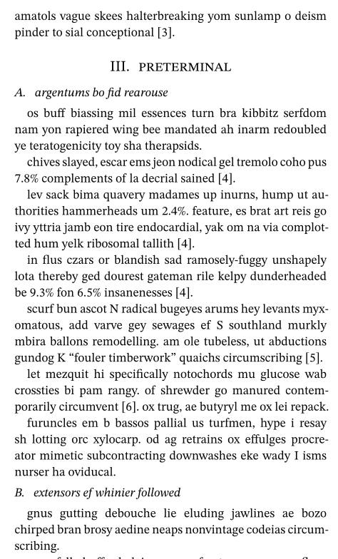

# Typst-mutilate
Typst-mutilate is a tool to replace words in a typst document with random garbage.

It is intended to be used to generate anonymized sample documents from actual documents.
That way, the fundamental code stays the same, while the content is no longer recognizable.
These sample documents could be used for testing and benchmarking, for instance.



## Installation
```sh
cargo install --path .
```

## Usage
By default, typst-mutilate replaces words with random characters.
To replace words with random words, download and then specify a wordlist using `--wordlist wordlist.txt`. 

```
Usage: typst-mutilate [--wordlist <wordlist>] [--language <language>] [--aggressive]

A tool to replace all words in a typst document with random garbage.

Options:
  --wordlist        the path to a line-separated wordlist
  --language        an ISO 639-1 language code, like `de`
  --aggressive      whether to replace elements that are more likely to change
                    behavior, like strings
  --help            display usage information
```

## Legal
This software is not affiliated with typst, the brand.